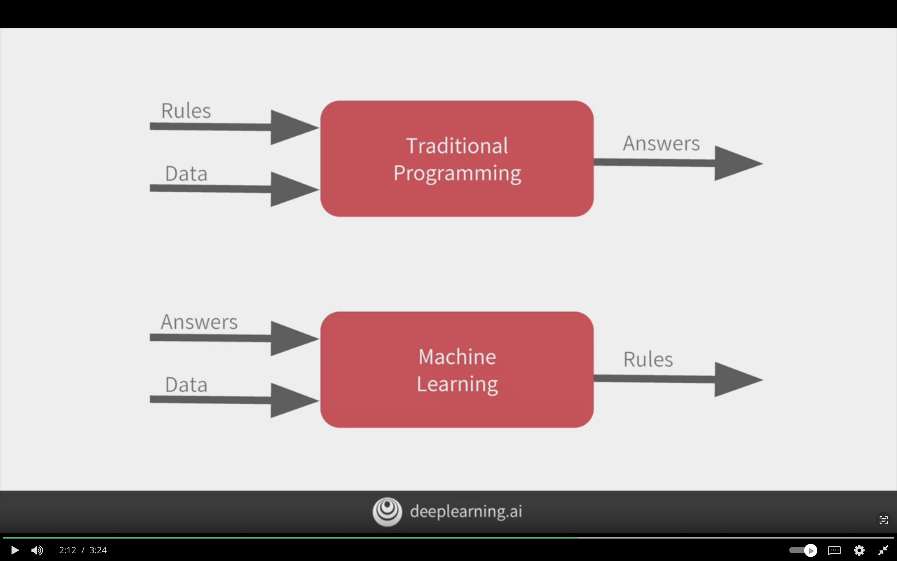

# A New Programming Paradigm

The following chapter will give an overall introduction to TensorFlow, Machine Learning, and Deep Learning.

## A Primer in Machine Learning

**In traditional programming:**

Input:
1. Rules
2. Data

Output:
1. Answers

**In Machine Learning:**

Input:
1. Answers
2. Data

Output:
1. Rules

The computer will figure out the rules for me

The following image showcases the difference between traditional programming and machine learning.
Where ML outputs the rules for me.


## The 'Hello World' of Neural Networks

Given a sequence of numbers in X and labels Y. What is the formula that results in x

$X = -1, 0, 1, 2, 3, 4$  
$y = -3, -1, 1, 3, 5, 7$

The formula is $f(x) = 2x -1$  

$f(-1) = 2(-1) -1 = -3$  
$f(0) = 2(0) -1 = -1$  
$f(1) = 2(1) -1 = 1$  
$f(2) = 2(2) -1 = 3$  
$f(3) = 2(3) -1 = 5$  
$f(4) = 2(4) -1 = 7$  

Code using keras and TensorFlow
Has 1 layers with 1 units/neuron
input_shape [1] because it is 1 value from x

```python
# defining a model with 1 layer and has 1 unit
# the layer has an input shape of [1] because it's 1 value
model = keras.Sequential([
    keras.layers.Dense(units=1, input_shape=[1])
    ])

# loss function and optimizer

# the loss is mean squared error
# loss function check how well the model performance then give to optimizer

# optimizer is stochastic gradient descent
# figures out the next prediction
model.compile(optimizer='sgd', loss='mean_squared_error')


# representing the known data wiht numpy arrays
xs = np.array([-1.0, 0.0, 1.0, 2.0, 3.0, 4.0], dtype=float)
ys = np.array([-3.0, -1.0, 1.0, 3.0, 5.0, 7.0], dtype=float)

# training the model with the fit command
# epochs mean will go through the data 500 times
# 1. make guess
# 2. measure how well the guess is with the loss function
# 3. use optimizer and data to make another guess
# 3. repeat
model.fit(xs, ys, epochs=500)


# not exactly 10 because there is not enough data
# when using nn they deal in probabilities so that's why
print(model.predict([10.0]))
```


