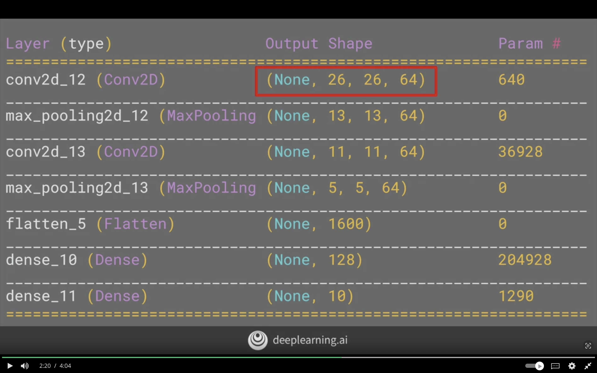
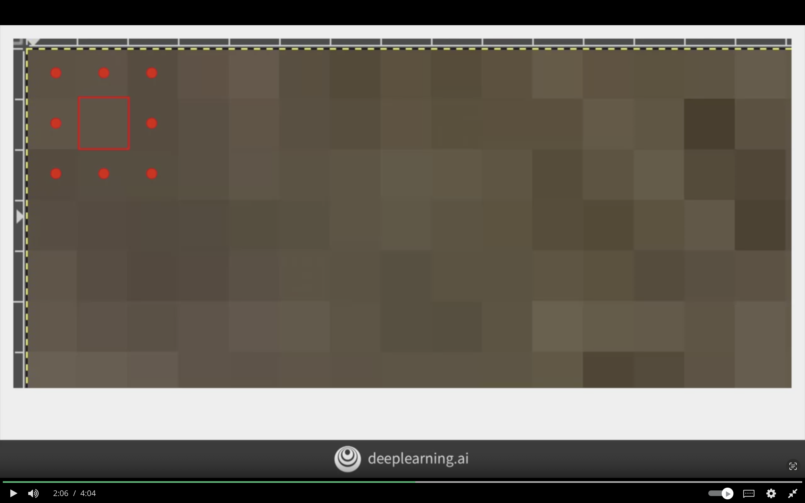

# Enhancing Vision with Convolutional Neural Networks

The following week willl cover convolutional neural networks, and it will go through the operation of convolution and maxpooling.

## What are Convolutions and Pooling?

Instead of looking at the entire pixels of image, and  it's wasted space.

Condense the image to the important features that distinguish what makes a hat or shirt.

**Convolution:**

  Having the filter passed through the image to change the underlying image.

- Sum of each neighbor value multiplied by the corresponding filter value.

- Certain features of image will be emphasized for each filter. For example, vertical lines, horizontal lines etc.

**Pooling**

A way of compressing an image.

- Pick the biggest value of each 4 neighbors in 4X4 Matrix.

- Perserve images highlighted by convolution, while quartering the size of image


### The model code below is an example of normal neural network

```python
model = tf.keras.models.Sequential([
    tf.keras.layers.Flatten(),
    tf.keras.layers.Dense(128, activation=tf.nn.relu),
    tf.keras.layers.Dense(10, activation=tf.nn.softmax),
])
```

### The model code below is an example of neural network with convolution and pooling layers

```python
model = tf.keras.models.Sequential([

    # create layer with 64 filters
    # each filter is 3X3
    # activation is relu (0,x)
    # input_shape is based on image shape which is 2D 28X28X1. Width X Height X Depth/Colors
    # Since it's grey it will be with 1 color 
    tf.keras.layers.Conv2D(64, (3,3), activation='relu', input_shape=(28, 28, 1))

    # creates pooling layer
    # it's max pooling because it will take the max value
    # 2,2 => 2X2 => 4 so for every 4 pixel, take the max
    tf.keras.layers.MaxPooling2D(2,2),


    # Another set of convolutions to be learned on top of exisiting
    tf.keras.layers.Conv2D(64, (3,3), activation='relu', input_shape=(28, 28, 1))

    # then pool to reduce the size
    tf.keras.layers.MaxPooling2D(2,2),


    # The content then is simply filtered to the features that determine the output


    # normal neural networks layers
    tf.keras.layers.Flatten(),
    tf.keras.layers.Dense(128, activation='relu'),
    tf.keras.layers.Dense(10, activation='softmax'),
])
```

### The below line of code displays the over summmary of model in each layer

```python
model.summary()
```

### Convolutional Neural Network Layers Shapes

Based on the `model.summary()` code we noticed the following


#### For the First Convolutional Layer

the input shape is the (26, 26, 64)
It is because we have removed 2 pixel from all around the image pixels.

So 2 pixels from y and 2 pixels from y

We did that in order to implement the convolution for image of size 28X28

so the final image size is 26X26



The following shows image pixels where 2 pixels removed from top, bottom, left and right.



If the filter is 5X5 and images is 28X28

The resulting input shape will be 24X24


**The formula can be defined as**

Convolution Output Shape = (image size) - (filter size-1)

Convolution Output Shape = (width, height) - [(filter width, filter height) - 1]


### For First Max Pooling

It will take the make based on the sepecified sizing which is 2X2

**The formula will be the following**

Max Pooling Output Shape = Convolution Output Shape / Pooling Size


### For Second Convolutional Layer

It will also take 2 pixels from x and y.

The result will be of shape of 11X11, compared to the max pooling layer which has 13X13 size.


### For Second Max Pooling

Dense Layer same as before but it's feed with 5X5 Images instead of 28X28.

The number of convolutions will be 64 convolutions per 1 image of size 28X28.


### Flatten Layer

It will have be the result of transformering 3D arrays/tensors into linear/ 1D array

Output Shape = 5 * 5 * 64 = 1600


## Improving the Fashion Classifier with Convolutions

