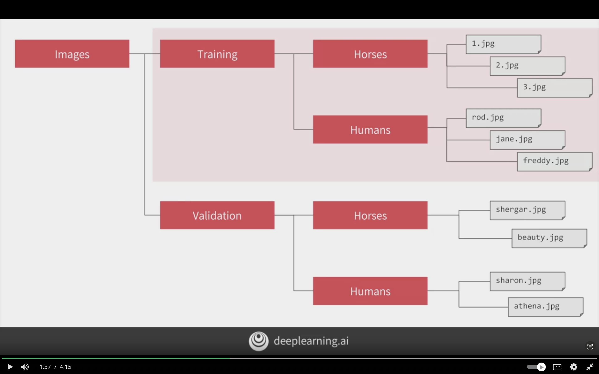

# Using Real World Images

Addressing the shortcomings when data are basic, and when images are larger. Also, when images are not in place. This chapter will cover complex images with CNN.

## Learning Objectives

- Reflect on the possible shortcomings of your binary classification model implementation
- Execute image preprocessing with the Keras ImageDataGenerator functionality
- Carry out real life image classification by leveraging a multilayer neural network for binary classification

## Understanding ImageDataGenerator

The limitations before were the images datasets were very uniformed where the subject in center, and images size were small 28X28.

For datasets before they were split into training and test subset for us. However, it's not always the case and have to be done by ourselves.

The ImageDataGenerator can be pointed to training directory and will have labels based on directory name, and all the images inside the directory will be autolabeled.

The same can be done for validation dataset.



#### For Training

```python
from tensorflow.keras..preprocessing.image import ImageDataGenerator

# rescale to normalize the data
train_datagen = ImageDataGenerator(rescale=1./255)


# to load images from directory and subdirectory
# images-dataset/training/image.png
# so it should be pointed at images-dataset/training

# name of directory will be the label
train_generator = train_datagen.flow_from_directory(
    
    # the root directory of images/training dataset
    train_dir,

    # images should all be same size
    # this will line will resize the dataset
    target_size=(300,300),

    # images loaded for training and validation in batches
    # for better performance
    batch_size=128,

    # because it's binary classification
    class_mode='binary'
)
```

#### For Validation

```python

# rescale to normalize the data
test_datagen = ImageDataGenerator(rescale=1./255)


# name of directory will be the label for test
validation_generator = test_datagen.flow_from_directory(
    
    # the root directory of images dataset
    validation_dir,

    # images should all be same size
    # this will line will resize the dataset
    target_size=(300,300),

    # images loaded for training and validation in batches
    # for better performance
    batch_size=128,

    # because it's binary classification
    class_mode='binary'
)
```


## Defining ConvNet to Use Complex Images

