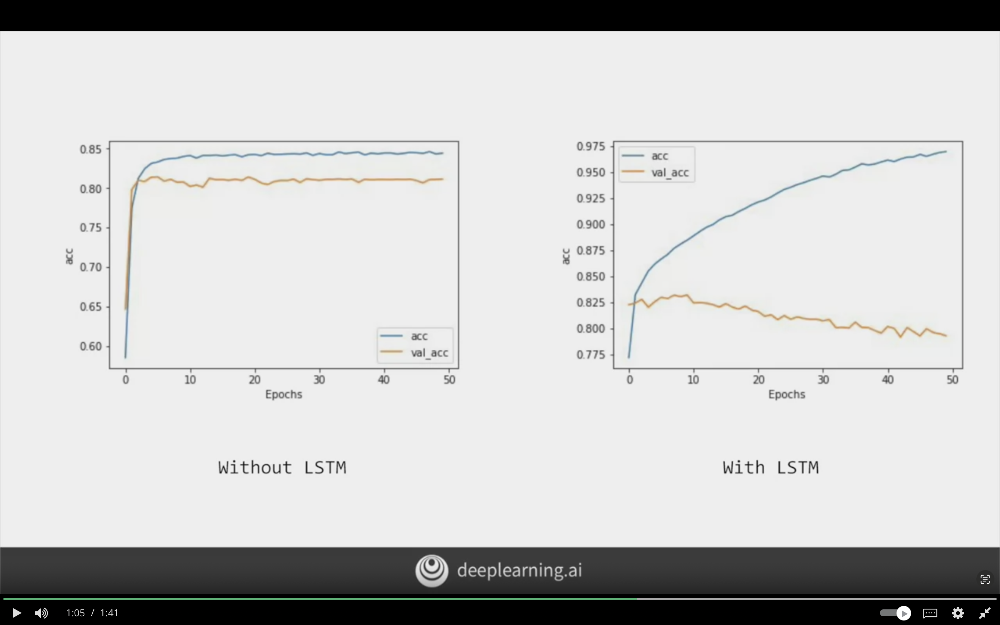
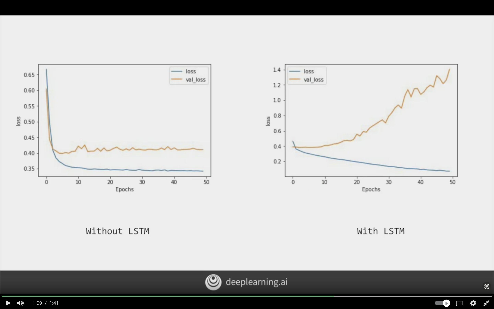
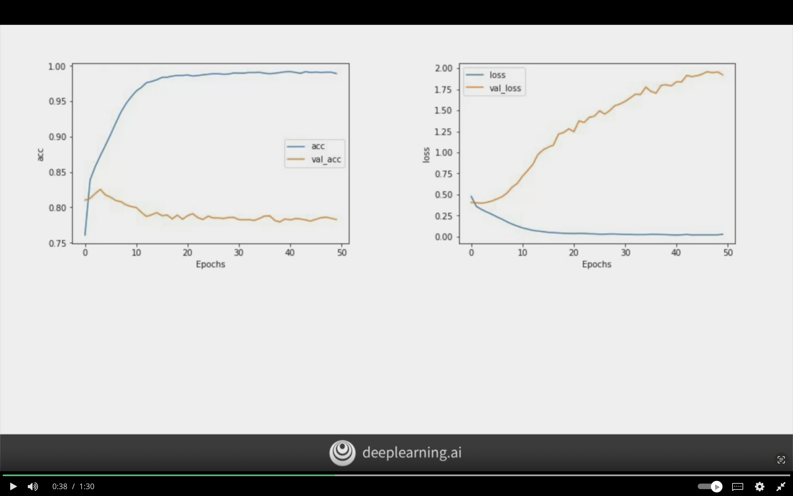

# Sequence Models

The following chapter will focus on using sequences to determine sentiment analysis. As we previously focused on words seperately, but word such as "not fun" should be labeled as negative class.

The order/sequence of words matters for the meaning of the sentence.

RNN can perserve the context from timestamp to timestamp, but it can be lost in long context. However, LSTM can perserve that context it has cell state, and it can perserve the context for long sentence.

## Introduction

Context of words was hard to follow when words is broken into sub-words, and the sequence which tokens for sub-words appear becomes very important in understanding their meaning.

Neural Network is like a function where it takes

**Input:**
- Data
- Labels

**Output:**
- Rules


$$
f(Data, Labels) = \text{Rules}
$$

But it does not take into account the sequence!

## Example of Fibonacci Sequence

The following image showcases the fibonacci sequence


Fibonacci sequence can be visualized as the below.
Where 2 input are carried to be summed to the next value, and the second value is carried to next summation.

It forms the base concept for Recurrent Neural Network (RNN)


The following image showcases RNN where it applies the same concept of sequencing from fibonacci. An input + output of previous function will be take as input to current function.


## LSTMs

 Today has a beatiful blue <...>
 Today has a beatiful **blue** sky (Blue gave us a clue on what next word will be)

 I lived in Ireland, so at school they made me learn how to speak <...>
 I lived in **Ireland**, so at school they made me learn how to speak Gaelic (Ireland gave use a clue on the next word)


Update to RNN called **LSTM** Long Short Term Memory

- Context is passed through LSTM
- Have additional pipeline of context called **Cell State**
- Context from earlier tokens relevant to later ones.
- Cell state can be bi-directional

The below visualizes LSTM, and it's bidirectional. So the context is being passed from the start to end, and from the end to start. The cell state store the context.


## Implementing LSTMs in Code

### Simple LSTM

The following code will implement LSTM

```python
model = tf.keras.Sequential([
    tf.keras.layers.Embedding(tokenizer.vocab_size, 64),

    # second layer as lstm
    # LSTM(64) is number of desired outputs of the layer
    # Bidirectional will make cell state go in both directions
    # output will be 128 for output shape
    tf.keras.layers.Bidirectional(tf.keras.layers.LSTM(64)),
    tf.keras.layers.Dense(64, activation='relu'),
    tf.keras.layers.Dense(1, activation='sigmoid')

])

```

### Stackable LSTMs

The following code will stack LSTM layers on top of each other. But return_sequenes=True is required in the first LSTM layer.

```python
model = tf.keras.Sequential([
    tf.keras.layers.Embedding(tokenizer.vocab_size, 64),

    # return_sequenes=True to ensure output of first lstm matches second 
    tf.keras.layers.Bidirectional(
        tf.keras.layers.LSTM(64, return_sequenes=True)
        ),
    tf.keras.layers.Bidirectional(tf.keras.layers.LSTM(32)),
    tf.keras.Dense(64, activation='relu'),
    tf.keras.Dense(1, activation='sigmoid')
    
])
```

## Loss and Accuracy Comparison Between 1 Layer LSTM vs 2 Layer LSTM


### 10 Epochs: Accuracy Measurement

The curve line is smoother in 2 layer LTSM, and for the 1 layer LSTM and it has jaggedness/jumping up and down means that the model needs improvement,


### 10 Epochs: Loss Measurement

The following image shows the loss measurement for layer 1 and layer 2. It can be seen that the same problem appearing.


### 50 Epochs: Accuracy Measurement

1 Layer LSTM while increasing accuracy is improving but it still suffers from dips. Meanwhile 2 Layer is much more smoother curve. The validation accuracy is also more smoother for layer 2.

It can been seen that there some difference between accuracy and validation accuracy, it's possible due to some words not being found in the test set.


### 50 Epochs: Loss Measurement

Loss is also similar with 2 layers having smoother curve, and the loss is increasing for validation epoch by epoch. The loss should be monitored for higher epochs to see if it gets flattened.


RNNs and LSTM inherent sequence are great for predicting unseen text for generating text.


### LSTM vs Non LSTM

```python
model = tf.keras.Sequential([

    # vocab_size is the number of unique words => considered as units/neurons count
    # embedding_dim is like the filter size in cnn
    # input_length is the max length of a single sequence of text
    tf.keras.layers.Embedding(
        vocab_size,
        embedding_dim,
        input_length= max_length
        ),
    
    # will be replaced with the below
    # tf.keras.layers.GlobalAveragePooling1D(),
    
    # defining LSTM
    tf.keras.layers.Bidirectional(tf.keras.layers.LSTM(32)),
    


    tf.keras.layers.Dense(24, activation='relu'),
    tf.keras.layers.Dense(1, activation='sigmoid'),
])
```


### Without LSTM vs Withb LSTM - Accuracy

The following image shows the difference between a model without LSTM layer vs LSTM layer model. It can be observed that without LSTM is reaching an accuracy of 0.85 and val_acc of 0.80.

Meanwhile, with LSTM is performing better and it keeps on climbing to 0.975, but the val_acc is decreasing which it indicates that the model is suffering from overfitting. This problem can be resolved with some tweaking.



### Without LSTM vs Withb LSTM - Loss

The following image shows loss of without LSTM and it reaches to healthy state quickly around 10 epochs and it flattened out.

While with LSTM the training loss have decreased nicely, but the val_loss is continuing to climb which it indicates overfitting problem in the network. The accuracy of prediction is increasing, but the confidence in it is decreasing.

I should be careful when adjusting the training parameters, when using different network type.



### Using a Convolutional Network

```python
model = tf.keras.Sequential([
    tf.keras.layers.Embedding(
        vocab_size,
        embedding_dim,
        input_length=max_length
        ),


    # words will be grouped into the size of filter =>5
    # the number of convolutions 128 to learn
    # the size of convolutions 5
    # the activation is relu
    tf.keras.layers.Conv1D(128, 5, activation='relu'),
    tf.keras.layers.GlobalMaxPooling1D(),


    tf.keras.layers.Dense(24, activation='relu'),
    tf.keras.layers.Dense(1, activation='relu'),
])

```

The following image showcases the loss when using convolution layers in text. The accuracy is even doing better than before, but it still suffers from overfitting as it not increasing in the val_acc. 

For the loss, it's increasing in the training set which it indicates overfitting problem.
It requires different combination of convolution layer to overcome this problem.
