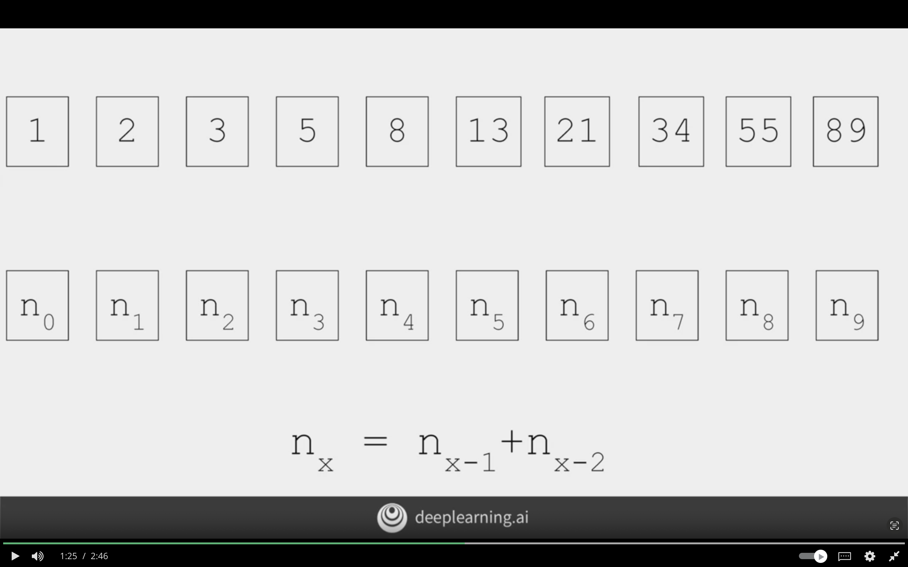
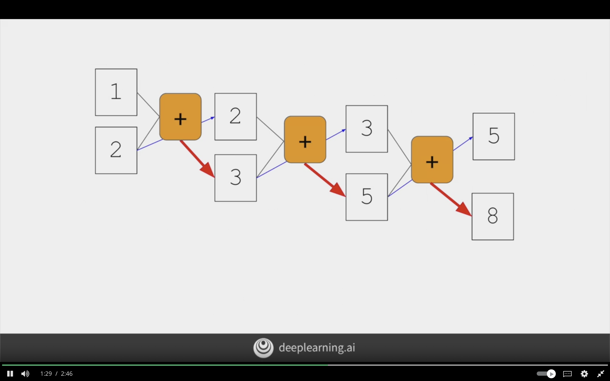
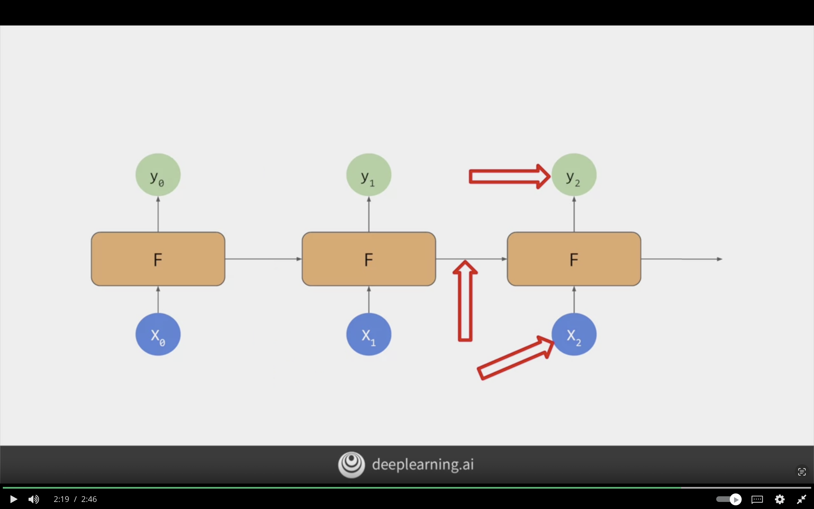
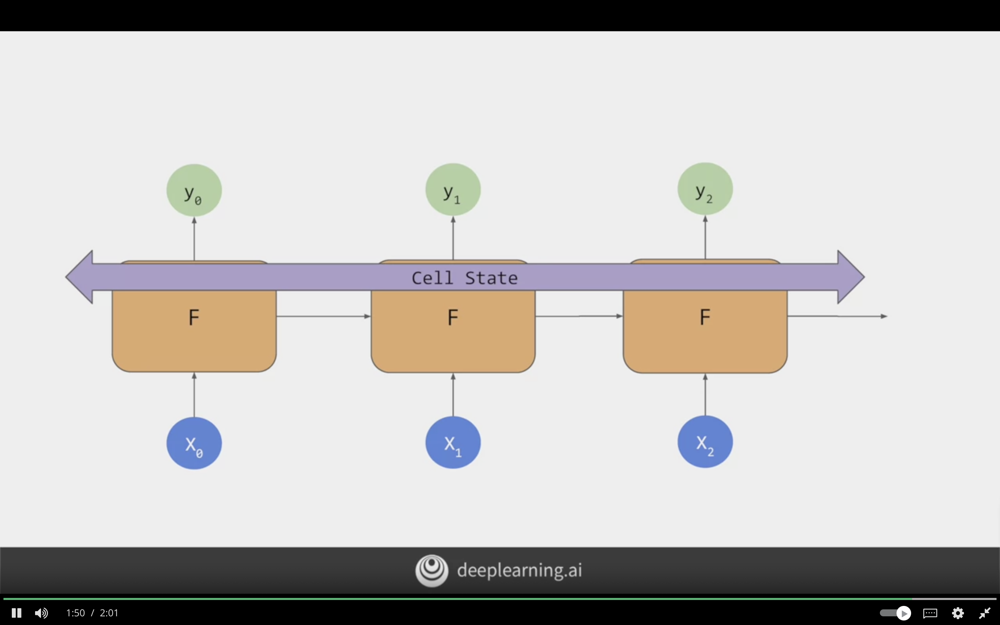
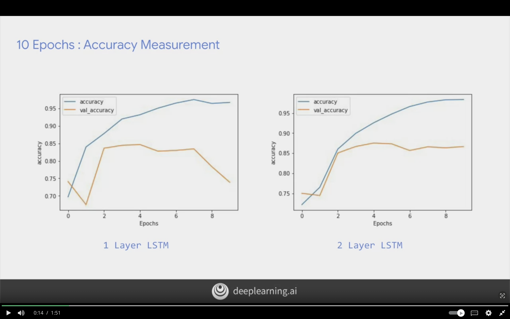
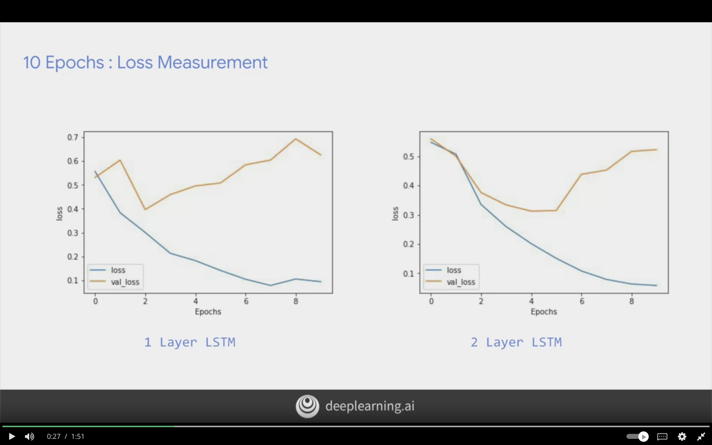
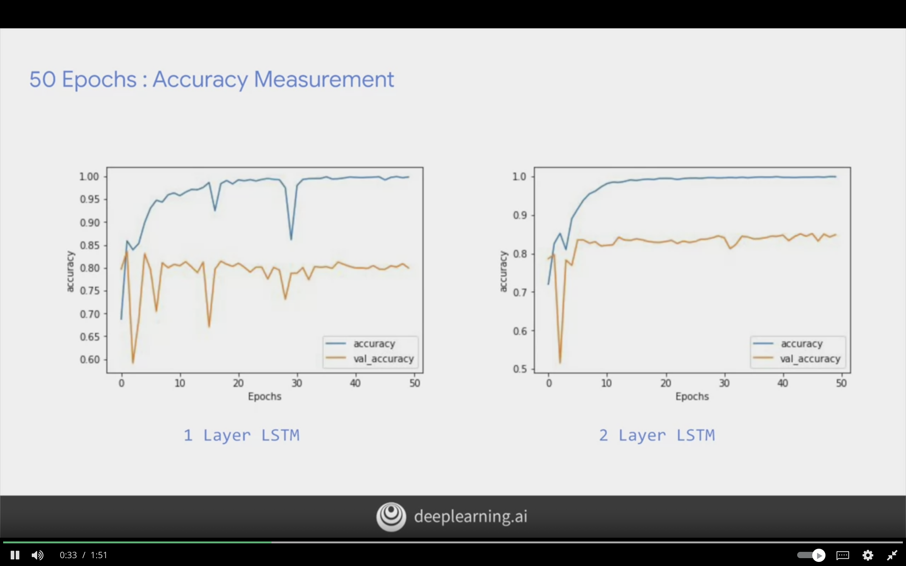
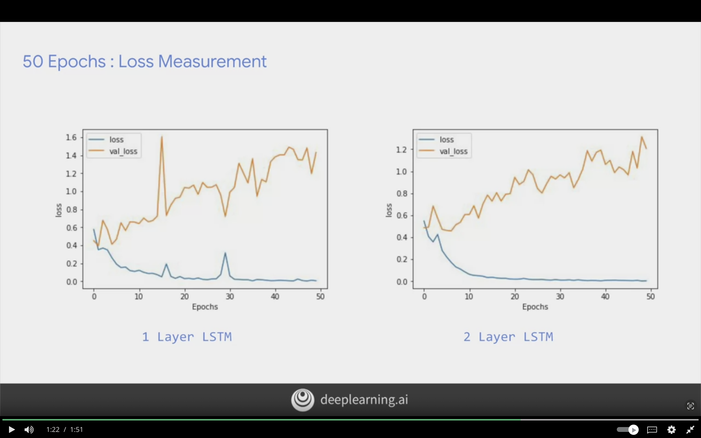

# Sequence Models

The following chapter will focus on using sequences to determine sentiment analysis. As we previously focused on words seperately, but word such as "not fun" should be labeled as negative class.

The order/sequence of words matters for the meaning of the sentence.

RNN can perserve the context from timestamp to timestamp, but it can be lost in long context. However, LSTM can perserve that context it has cell state, and it can perserve the context for long sentence.

## Introduction

Context of words was hard to follow when words is broken into sub-words, and the sequence which tokens for sub-words appear becomes very important in understanding their meaning.

Neural Network is like a function where it takes

**Input:**
- Data
- Labels

**Output:**
- Rules


$$
f(Data, Labels) = \text{Rules}
$$

But it does not take into account the sequence!

## Example of Fibonacci Sequence

The following image showcases the fibonacci sequence



Fibonacci sequence can be visualized as the below.
Where 2 input are carried to be summed to the next value, and the second value is carried to next summation.

It forms the base concept for Recurrent Neural Network (RNN)



The following image showcases RNN where it applies the same concept of sequencing from fibonacci. An input + output of previous function will be take as input to current function.


## LSTMs

 Today has a beatiful blue <...>
 Today has a beatiful **blue** sky (Blue gave us a clue on what next word will be)

 I lived in Ireland, so at school they made me learn how to speak <...>
 I lived in **Ireland**, so at school they made me learn how to speak Gaelic (Ireland gave use a clue on the next word)


Update to RNN called **LSTM** Long Short Term Memory

- Context is passed through LSTM
- Have additional pipeline of context called **Cell State**
- Context from earlier tokens relevant to later ones.
- Cell state can be bi-directional

The below visualizes LSTM, and it's bidirectional. So the context is being passed from the start to end, and from the end to start. The cell state store the context.


## Implementing LSTMs in Code

### Simple LSTM

The following code will implement LSTM

```python
model = tf.keras.Sequential([
    tf.keras.layers.Embedding(tokenizer.vocab_size, 64),

    # second layer as lstm
    # LSTM(64) is number of desired outputs of the layer
    # Bidirectional will make cell state go in both directions
    # output will be 128 for output shape
    tf.keras.layers.Bidirectional(tf.keras.layers.LSTM(64)),
    tf.keras.layers.Dense(64, activation='relu'),
    tf.keras.layers.Dense(1, activation='sigmoid')

])

```

### Stackable LSTMs

The following code will stack LSTM layers on top of each other. But return_sequenes=True is required in the first LSTM layer.

```python
model = tf.keras.Sequential([
    tf.keras.layers.Embedding(tokenizer.vocab_size, 64),

    # return_sequenes=True to ensure output of first lstm matches second 
    tf.keras.layers.Bidirectional(
        tf.keras.layers.LSTM(64, return_sequenes=True)
        ),
    tf.keras.layers.Bidirectional(tf.keras.layers.LSTM(32)),
    tf.keras.Dense(64, activation='relu'),
    tf.keras.Dense(1, activation='sigmoid')
    
])
```

## Loss and Accuracy Comparison Between 1 Layer LSTM vs 2 Layer LSTM


### 10 Epochs: Accuracy Measurement

The curve line is smoother in 2 layer LTSM, and for the 1 layer LSTM and it has jaggedness/jumping up and down means that the model needs improvement,



### 10 Epochs: Loss Measurement

The following image shows the loss measurement for layer 1 and layer 2. It can be seen that the same problem appearing.



### 50 Epochs: Accuracy Measurement

1 Layer LSTM while increasing accuracy is improving but it still suffers from dips. Meanwhile 2 Layer is much more smoother curve. The validation accuracy is also more smoother for layer 2.

It can been seen that there some difference between accuracy and validation accuracy, it's possible due to some words not being found in the test set.


### 50 Epochs: Loss Measurement

Loss is also similar with 2 layers having smoother curve, and the loss is increasing for validation epoch by epoch. The loss should be monitored for higher epochs to see if it gets flattened.



RNNs and LSTM inherent sequence are great for predicting unseen text for generating text.