# Sequences and Prediction


**Time Series:**
A series of data that changes across time, and how it's measure over time.

Stock prices, Weather Forecasts, and SunSpot activity.

## Time Series Examples

- stock prices
- weather forecasts
- historical trends
- Moore's law
- The number of transistors per square millimeter
- Correlation of total revenue generated by video game arcades versus computer science doctorates awarded in the United States

**What is a time series?**
An ordered sequence of values that are usually equally spaced over time.

**Univariate Time Series:**
Single value at each time stamp

**Multivariate Time Series:**
Multiple values at each time stamp.

- Can be useful for understanding the impact of related data.

## Machine Learning Applied to Time Series

**Data Imputation:**

- Projecting back into the past to see how we get where we are now
- Fill in holes for when data does not exist

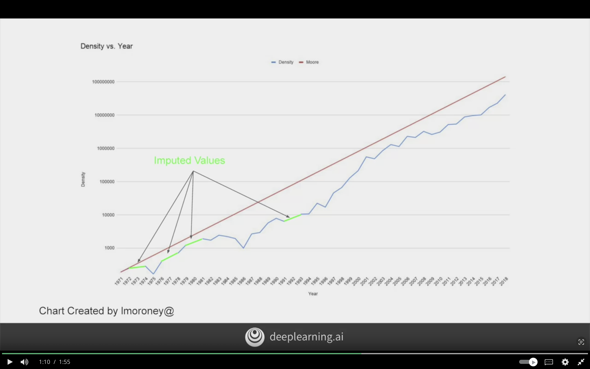


### Time series prediction in Anomaly

- In website logs, to see when there's potential DDoS attack.


### Anaylze Time series to spot patterns in Them, and deteremine which generated the series itself

- Analyze sound waves to spot words in them. Which can be used fo Speech Recognition
- Using Machine Learning, it's possibel to train neural network based on time series to recognize words or subwords


## Common Patterns in Time Series

### 1- Trend

Where time series has a specific direction that they're moving in.

Moore's Law
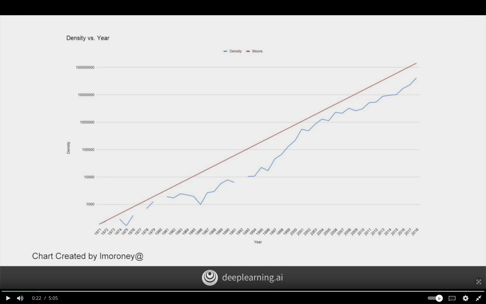

### 2- Seasonalitiy

Where patterns repeat at predictable interval.

Active users at a website for software developers. The dips means it's weekend, when it's less people working.
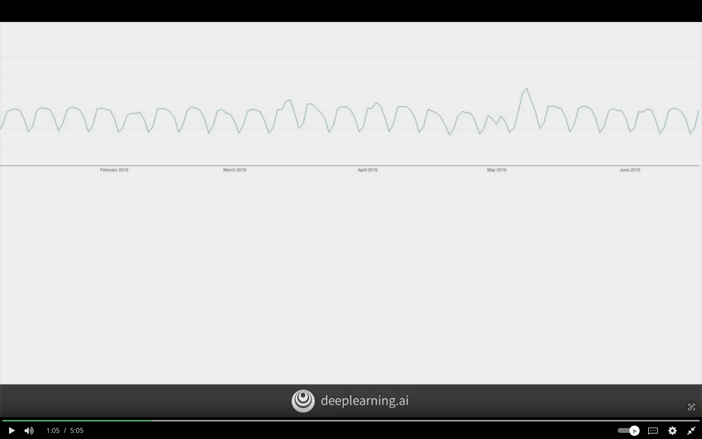

### 3- Combination of Trend and Seasonalitiy

There's overall upward trends, but there are local peaks and troughs/dips.
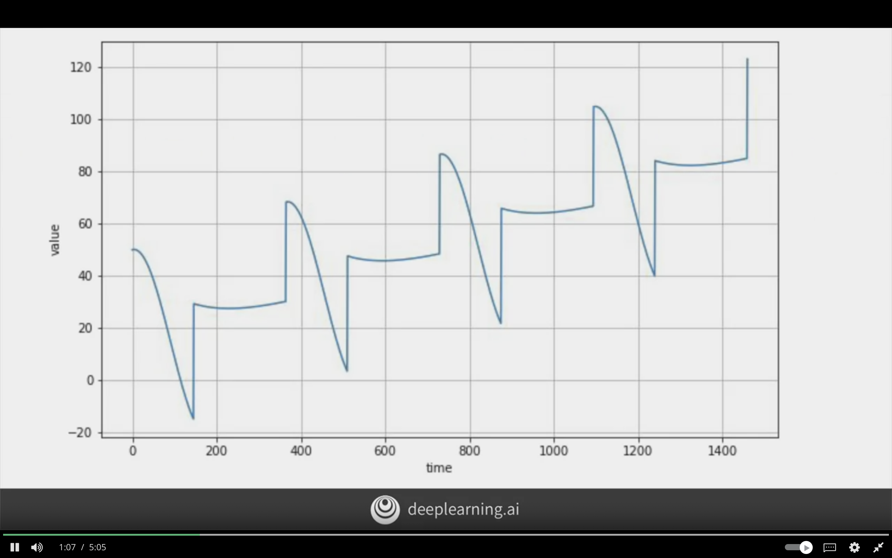

### 4- Not Predicatble/Noise

Complete set of random values producing white noise, and there's nothing to do.
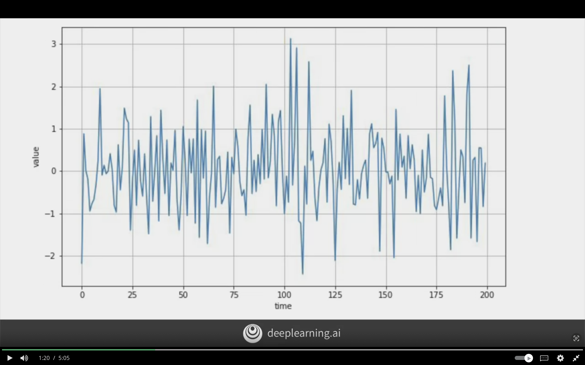

### 5- Autocorrelated Time Series

#### Simple AutoCorrelated

Correlates with delayed copy of itself often called "Lag".
Often this type described having memory as steps are dependent of previous ones.
- Unpredictable spikes called "Innovations"
- They cannot be predicted on previous values

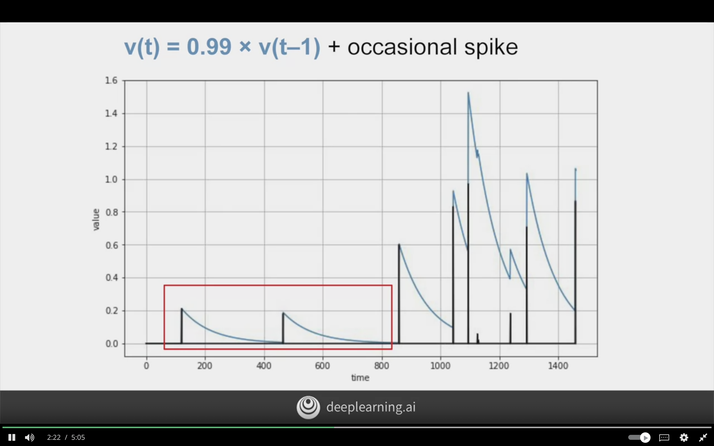

#### Multiple AutoCorrelated
Another example where there is multiple autocorrelation in time steps 1 and 50.
- Lag 1 gives these very quick short term exponential delays
- Lag 50 gives the small balance after each spike

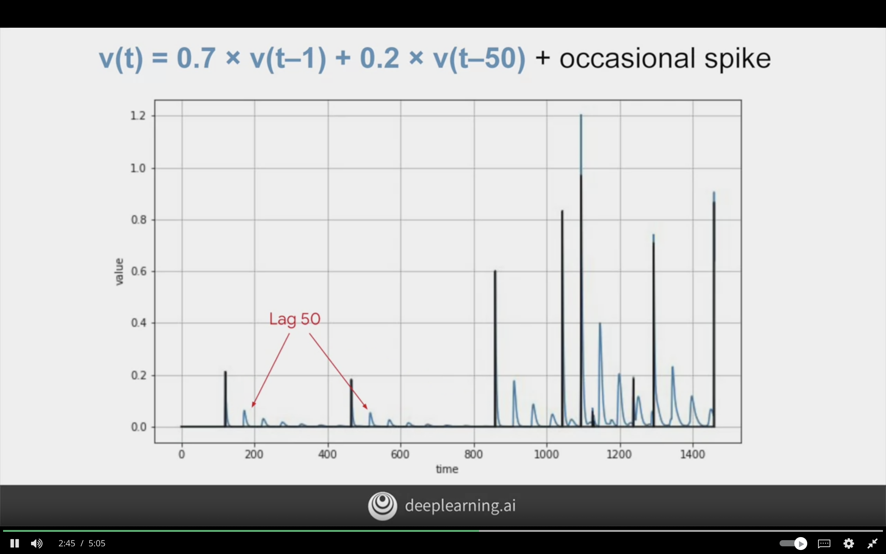


### 6- Trend + Seasonality + Autocorrelation + Noise

Time series in real life often are a mixture of multiple time series type features combined.

Machine learning models are designed to spot patterns, and then we can make predictions.

Patterns in the past will continue to occur in the future.

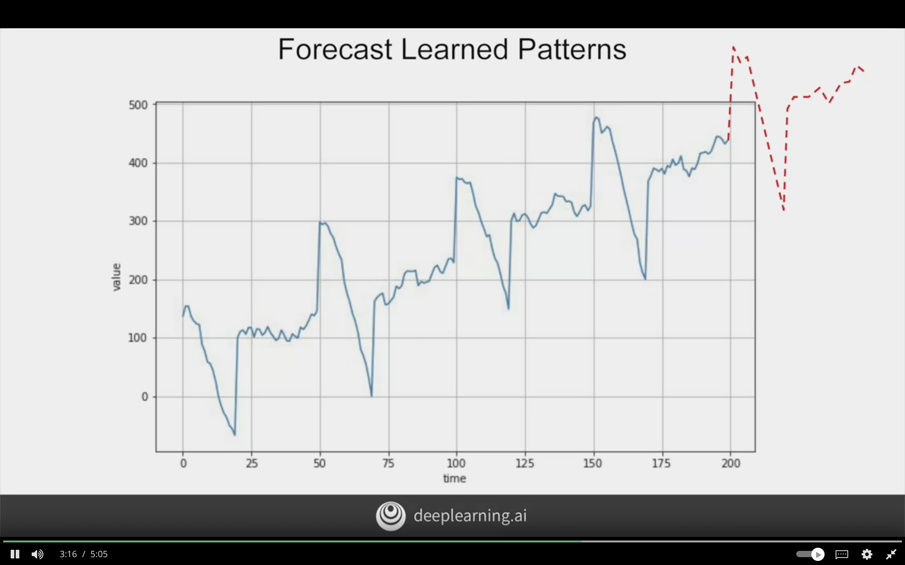

### Non-Stationary Time Series

Something unordinary happened that caused a shift in the pattern, financial crisis (2008).

We coul train for a limited period of time. For example only on the last 500 steps.

Ideally it's better if we can take the entire model, but it's not very simple.

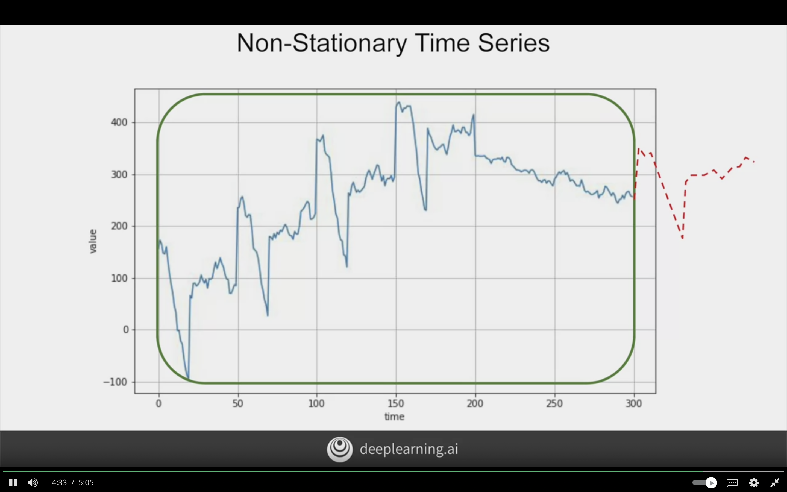

## Train, Validation, and Test Sets

The following secion will look at techniques that can be used to forecast that time series.

### Trend + Seasonality + Noise

The following is an example of time series with trend, seasonality and noise.
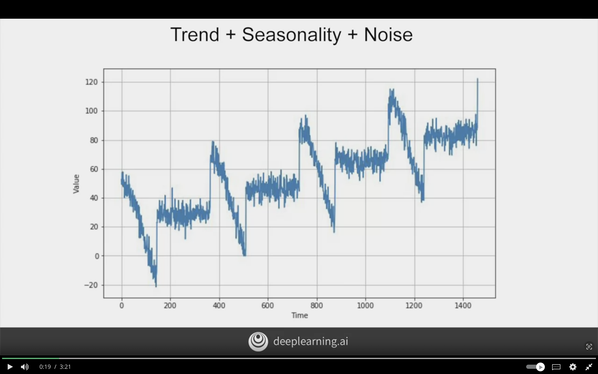

#### Naive Forecasting can be used

Take the last value and assume the next will be the same.

Focus on small part of the time series, to get the baseline at the very least, and can be good.

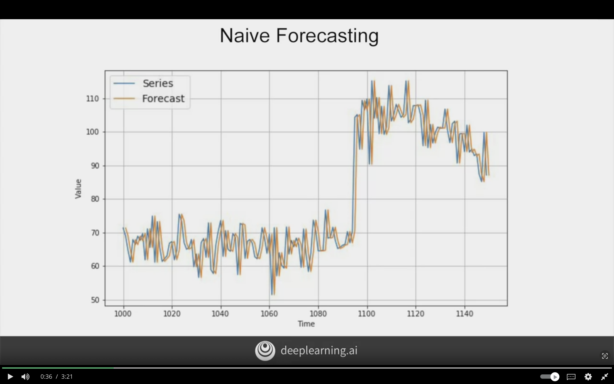

### Fixed Partitioning

- To measue the performance of our forecasting model

- The time series can be split into Training Period, Validation Period, and Test Period

- Train the model on the Training Period

- Evaluate the model on the Validation Period

- Retrain using both the training and validation data

- Then test on Test Period to see if model will perform as well

- Retraining again using the Test Data, because the test data is the closest data to current point of time, and it's strongest signal to determine future values

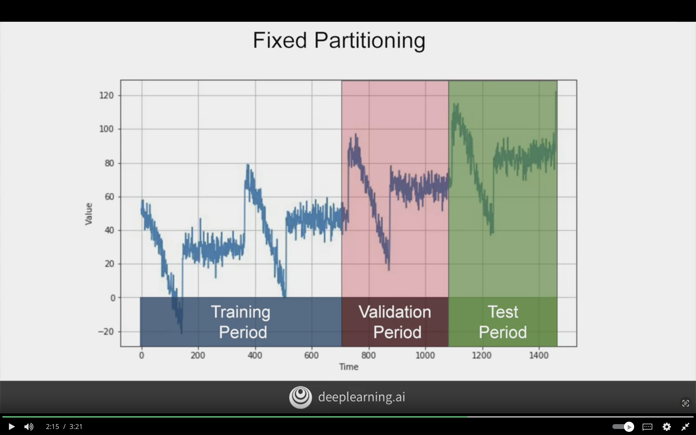

Also, it's common to train using the Training Period, and Validation Period, and test set is in the future

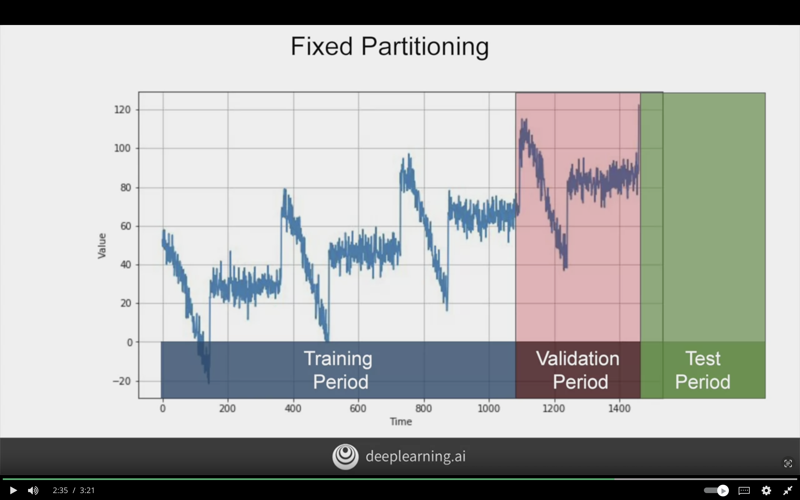


### Roll-Forward Partitioning

Start wuth short training period and then gradually increase it by 1 day or week at a time. At each iteration we train the model on training period, and use it to forecast the following day or week in validation period.

Doing fixed partitioning a number of times, and continually refining the model as such.

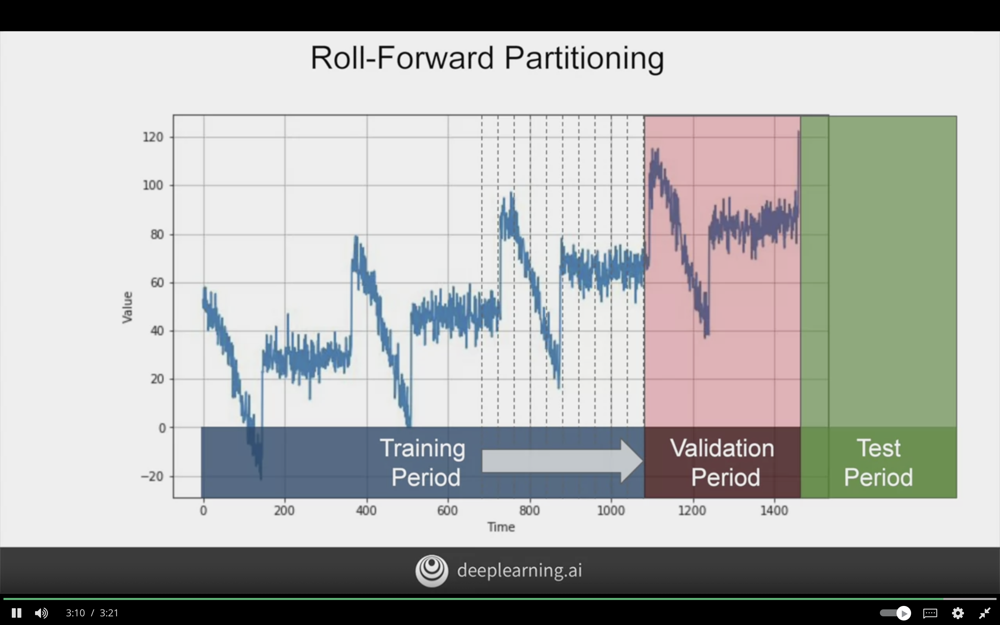

## Metrics of Evaluting Performance

### Using NumPy for Evaluating Forecasts

```python
# Difference between forecasted values of model and actual values over the evalution period
errors = forecasts - actual

# mean squared error, to remove -ve values
mse = np.square(errors).mean()


# mean of error calculation of same scale as original error
# root mean squared error
rmse = np.sqrt(mse)


# mean absolute error
# or mean absolute deviation => mad
# does not penalize large error
# 
mae = np.abs(errors).mean()


# mean absolute percentage error
# mean ratio between absolute errors and absolute values
# idea of size of error compared to values
mape = np.abs(errors / x_valid).mean()
```

### Using Keras for Naive Forecast MAE

If we look at our data we can measure the MAE using the following code

```python
keras.metrics.mean_absolute_error(x_valid, naive_forecast).numpy()

# 5.937...

```

## Moving Average

The yellow line is a plot of the average of blue values over fixed period called **Averaging Window**.

For example 30 days.

- Eliminates Noise
- Gives a curve roughly emulating the original series
- Does not anticipate trends or seasonality

**Depnding on current time like the period after wanting to forecast for future.**  
It can be worse than naive forecast

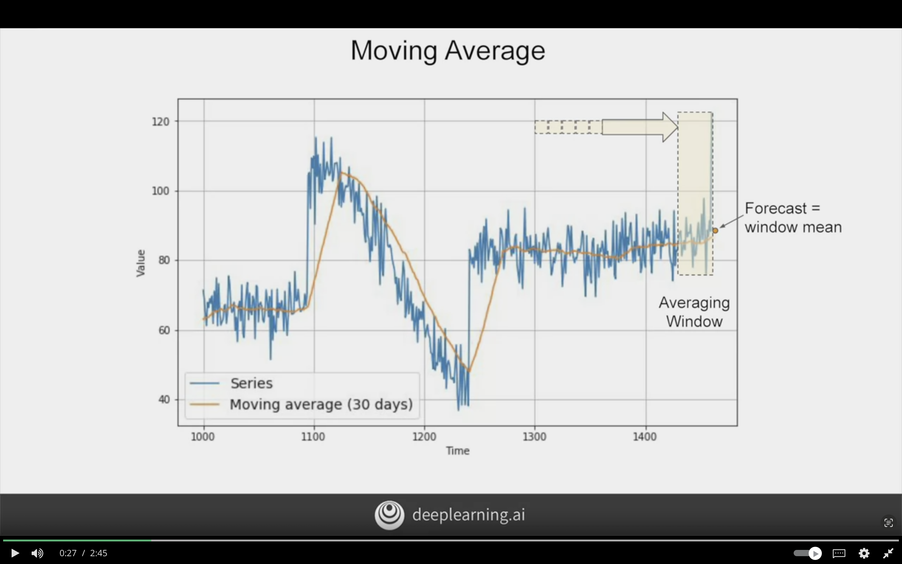


## Differencing

Remove the trend and seasonality from the time series

Study the difference between the value at time T and value at earlier period. Can be year, month, or day.
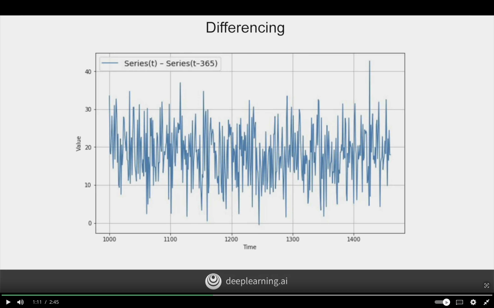

For example 1 year => T-365


### Moving Average on Difference Time Series

- Use moving average for the earlier period to forecast the difference time series and not original.

Moving Average on Differenced Time Series
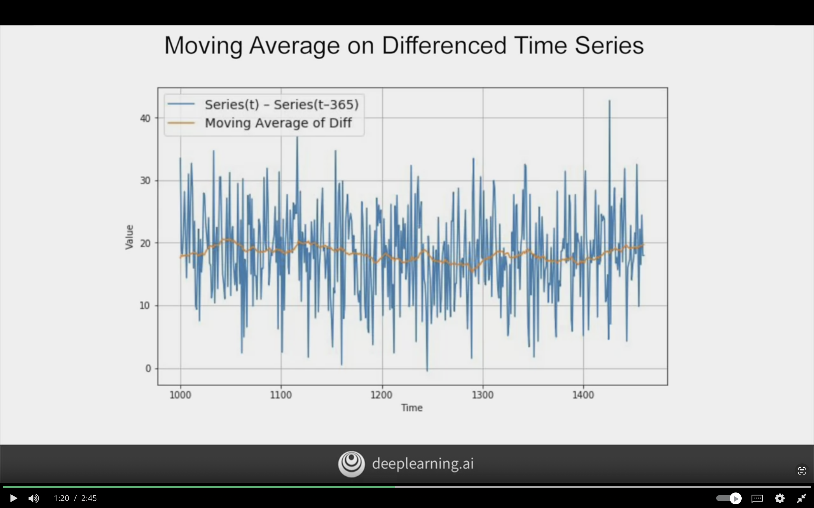

### Restoring the Trend and Seasonality

To get the final forecasts for original time series:  
- Add back the value at time T - 365

Forecasts = moving average of differenced series + series(T - 365)
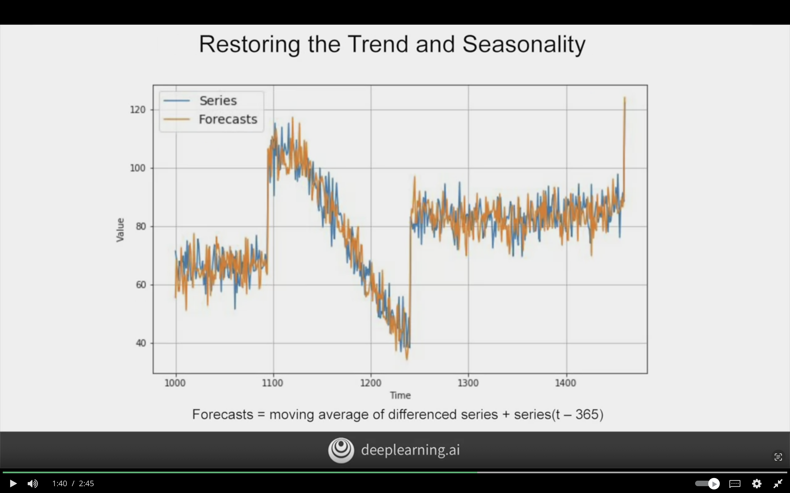


### Smoothing Both PAst and Present Values

Forecasts can improved by removing the past noise using moving average on that.

Forecasts = training moving average of differenced series + centered moving average of past series(T - 365)

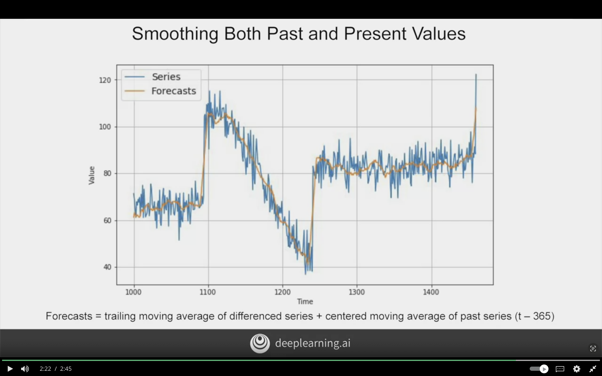

