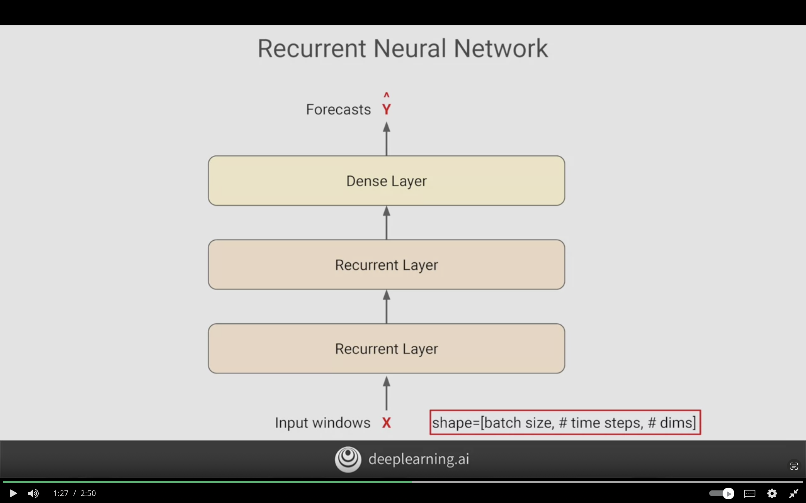
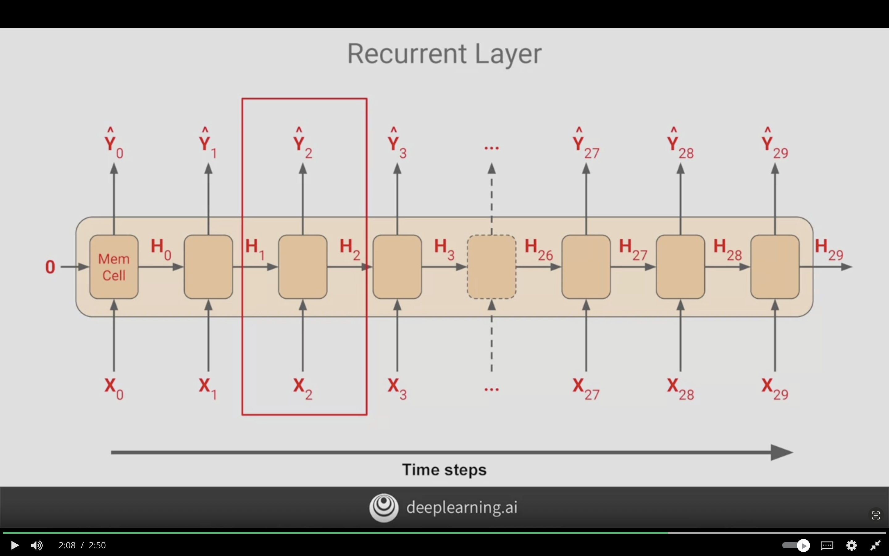

# Recurrent Neural Networks for Time Series

This week will focus on using Recurrent Neural Networks (RNN) and Long Short Term Memeory Neural Networks (LSTM) on time series data.

## Intro

### Lambda Layer

Allows us to write aribitary code as a layer in the neural networks.

**For example:**  
Scaling data with explicit pre-processing step and then feed it to neural networks.

Instead, I can have Lambda Layer that implemented as layer in the neural network, that resends data, scales it. The preproecssing step is part of the neural network.

## Conceptual Overview

### Recurrent Neural Networks

It's a neural network that contains recurrent layers. 

- It is desgined to sequentially process a sequence of inputs

- Able to process al types of sequences

- It will be feed batches of sequences

- and It will output a batches of forecasts
- Shape of RNN will be 3D, shape = [batch size, # time steps, # dims of inputs at each time stamp]
  - Univariate will be 1
  - Multivariate will be 2+

The following is the architecture of the Recurrent Neural Network to be used for time series.

### Recurrent Layer

#### Why Recurrent Neural Network they are called ?

because the values recur due to the ouput of cell. A one-step is being feed back into itself at the next time step.

**Helpful for determining states:**  
- As the location of word in sentance can determine it's semantics and meaning.
- Same for numeric value as the closer numbers have closer impact than far numbers

