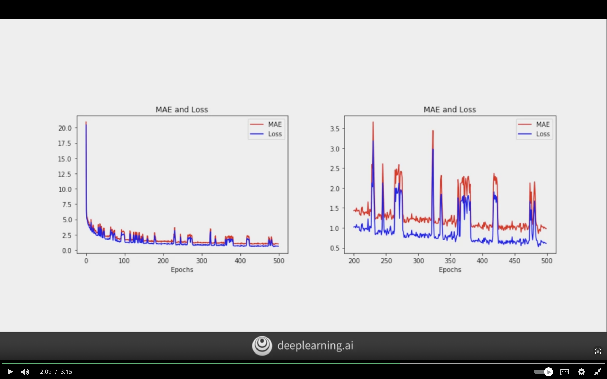
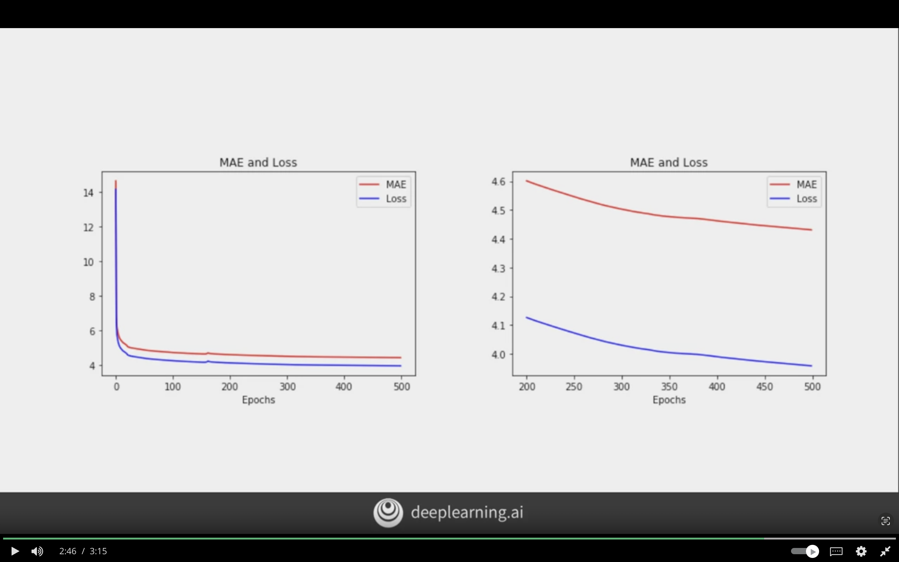

# Real-World Time Series Data

The following section will focus on adding cobvolutions on top of DNNs and RNNs, and using real-world time series data. In particular, time series data for measuring sunspot activity over hundards of years, and try to predict using it

## Convolutions

Combining convolutions with LSTM to get a nicely fitting data.

### Windowed Dataset

The following code to generate windowed dataset
```python

def windowed_dataset(series, window_size, batch_size, shuffle_buffer):

    # create dataset object from numoy series
    ds = tf.data.Dataset.from_tensor_slces(series)


    # create windows subsets of the dataset
    # shift each window by 1
    # if subset windows have les size than window + 1
    # then drop the subset
    ds = ds.window(window_size + 1, shift=1, drop_remainder=True)

    # flatten the dataset into batches of size window_size + 1
    ds = ds.flat_map(lambda w: w.batch(window_size + 1))

    # shuffle the dataset given the shuffle buffer
    ds = ds.shuffle(shuffle_buffer)

    # will create tuple of features and labels
    ds = ds.map(lambda w: (w[:-1], w[-1]))

    # return the dataset in the specfied batch_size
    # prefetch 1 batch to memory to speed up
    return ds.batch(batch_size).prefetch(1)
```


### Convolutions on Time Series Example

The following is the LSTM code that was considered in week-3 of the course.

```python
model = tf.keras.models.Sequential([

    # added 1D convolution layer
    # will take 5 number window
    # kernel_size is single value cuz it's 1D
    # and it mutliply it by 32 filters (same as convolution)
    # strides=1 => skip 1 element each time
    # padding=causal will add 0 at start
    # [0 0 1 2 3]=> first stride [0 0 1] => second [0 1 2]
    # relu activation
    # input_shape=[None, 1] specified input shape, not Lambda
    tf.keras.layers.Conv1D(
        filters=32,
        kernel_size=5,
        strides=1,
        padding="casual",
        activation="relu",
        input_shape=[None, 1]
    ),

    # 2 unidirectional lstm layers
    tf.keras.layers.LSTM(32, return_seqeunces=True),
    tf.keras.layers.LSTM(32),


    # 2 bidirectional lstm layers
    # but it's overfitting

    # tf.keras.layers.Bidirectional(tf.keras.layers.LSTM(32, return_seqeunces=True)),
    # tf.keras.layers.Bidirectional(tf.keras.layers.LSTM(32)),

    # output layer
    tf.keras.layers.Dense(1),

    tf.keras.layers.Lambda(lambda x: x * 200)
])

# defining optimizer here
# the learning rate can be found using callbacks
optimizer = tf.keras.optimizers.SGD(learning_rate=1e-5, momentum=0.9)

# compiling the model
model.compile(
    loss=tf.keras.losses.Huber(),
    optimizer=optimizer,
    metrics=["mae"]
    )

# training the model
model.fit(dataset, epochs=500)

```

### Result

**Problem:**  
Adding the Bidirectional LSTM layers causes the model to overfit.

- Requires a small tweak in parameters to avoid overfitting
- Caused by a small batch introducing random noise 



**Solution:**  
Explore batch size and make sure it's appropriate for the data

To overcome the model overfitting the batch size decreased from 32 to 16. The results are as follows

It is now more stable and we have overcome the overfiting problem.



## Real Data - Sunspots


## Train and Tune the Model

### Simple DNN

The following code is a simple DNN we used in DNN

```python
# creating the windowed dataset
dataset = windowed_dataset(x_train, window_size, batch_size, suffle_buffer_size)


# defining simple DNN
model = tf.keras.Sequential([

    # layer before the change to get better result
    # tf.keras.layers.Dense(10, input_shape=[window_size], activation='relu'),
    # tf.keras.layers.Dense(10, activation='relu'),


    tf.keras.layers.Dense(30, input_shape=[window_size], activation='relu'),
    tf.keras.layers.Dense(15, activation='relu'),
    tf.keras.layers.Dense(1)
])


# compiling the model
model.compile(
    loss="mse", 
    
    # before the change
    # optimizer=tf.keras.optimizers.SGD(learning_rate=1e-6, momentum=0.9)
    
    # learning_rate lowered to 1e-7
    optimizer=tf.keras.optimizers.SGD(learning_rate=1e-7, momentum=0.9)
)

# training the model
model.fit(dataset, epochs=100, verbose=0)
```

### Result

The model has an MAE of 19.32425

The clue to the issue is the window size that was used, ot it could be other hyperparameters selected

```python

# total data is 3500
# so currently it's 1000 train, 2500 validation
# split_time = 1000

# will be changed to this
# 3000 for train, and 500 for validation
# this got the result to MAE= 15.144
split_time = 3000


time_train = time[:split_time]
x_train = time[:split_time]

time_valid = time[split_time:]
x_valid = time[split_time:]


# possible root cause
# the training window size is 20 slices of data
# the window is little under 2 years
# window_size = 20

# will be changed to this
# 11 years worth of data
# did not help, and results are worse
# window_size = 132

# will be then changed to this
window_size = 30


batch_size = 32
shuffle_buffer_size = 1000

```


## Process of imporving the Performance

1. Increased the window_size from 20 to 132
    - results got worse MAE = 23.540
2. Increased window_size from 20 to 30
    - results got better
3. split_time changed from 1000 to 3000 so now the split is 3000 for train, and 500 for valid
    - results go better MAE = 15.144
4. Changing the model architecture for first layer from 10 to 30, and second layer from 10 to 15
    - results got better slighly MAE = 14.348
5. The model layers have reverted back to 10, 10 at each layer
6. Changing the learning_rate of the model from 1e-6 to 1e-7
    - results got better MAE = 14.122


## Prediction

Thw window size used is 30 steps, and the dataset is 3235 long.

```python
model.predict(series[3205:3234][np.newaxis])
# 7.0663993
```

The following is another model architecture with MAE of 13.75

```python
split_time = 3000
window_size = 60

model = tf.keras.Sequential([
    tf.keras.layers.Dense(20, input_shape=[window_size], activation="relu"),

    tf.keras.layers.Dense(10, activation="relu"),

    tf.keras.layers.Dense(1)
])


model.compile(
    loss="mse",
    optimizer=tf.keras.optimzers.SGD(lr=1e-7, momentum=0.9)
)

# prediction is 8.13
```

## Combining our Tools for Analysis

The following code all tools we used to get better results. Which are combining CNN and LSTM

```python

# setting the window and batch size
window_size = 60


# batch_size = 64
# got changed to
batch_size = 256

# creating the training set
train_set = windowed_dataset(x_train, window_size, batch_size, shuffle_buffer_size)


# defining the DNN model
model = tf.keras.Sequential([

    # 1D convolution that will learn 32 filters
    tf.keras.layers.Conv1D(
        filters=32,
        kernel_size=5
        strides=1,
        padding="casual",
        activation="relu",
        input_shape=[None, 1]
    ),

    # LSTM layers with 32 units each
    # tf.keras.layers.LSTM(32, return_sequences=True),
    # tf.keras.layers.LSTM(32),

    # LSTM layers with 60 units each
    tf.keras.layers.LSTM(60, return_sequences=True),
    tf.keras.layers.LSTM(60),

    # Dense Layers
    tf.keras.layers.Dense(30, activation="relu"),
    tf.keras.layers.Dense(10, activation="relu"),
    
    # Output layer
    # of single neuron
    tf.keras.layers.Dense(1),

    # Lambda Layer
    # increase the output range so the model have better training
    tf.keras.layers.Lambda(lambda x: x * 400)
])


# defining the optimizer
# 10^-5 learning rate
optimizer = tf.keras.optimizers.SGD(
    learning_rate=1e-5,
    momentum=0.9
    )

# compiling the model
model.compile(
    loss=tf.keras.losses.Huber(),
    optimizer=optimizer,
    metrics=["mae"]
)

# training the model
model.fit(dataset, epochs=500)


# results
# MAE of 14.456
# loss have a lot of noise

```

### Improving the Performance Process

1. Increasing the batch size from 64 to 256
    - The results improved to MAE= 14.394
    - There is some noise at the end, but regular waves
2. Changing batch_size to 250, make the parameters evenly divisble to 3000 to suit. Also, change filters to from 32 to 60, and LSTM units from 32 to 60
    - The noise and loss function have increased a bit MAE= 14.835
3. Change batch_size from 60 to 100
    - The results have increase, MAE = 15.400, and loss have smoothed out except for small parts


**Q: Why is MAE a good analytic for measuring accuracy of predictions for time series?**  

It doesn't heavily punish larger errors like square errors do